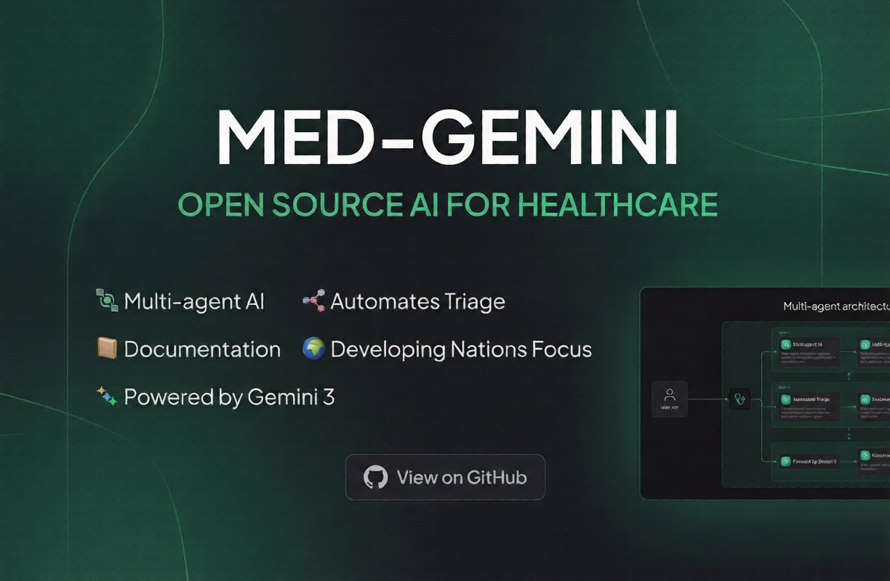
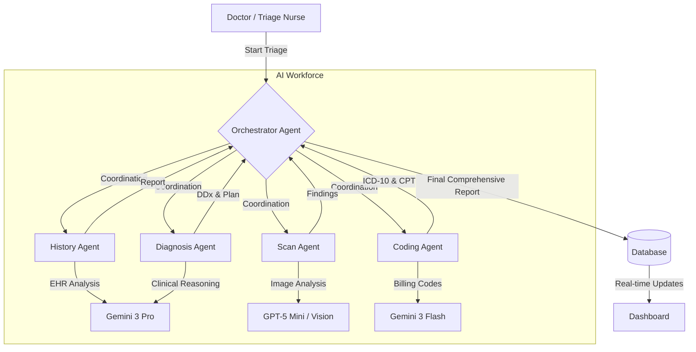
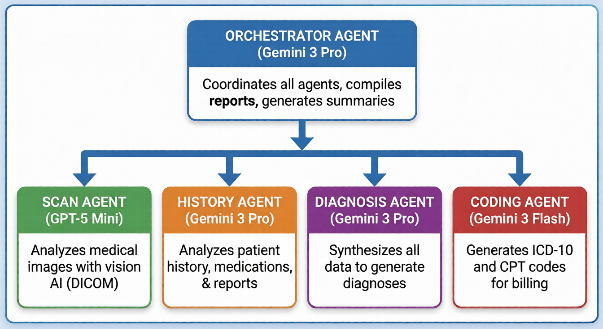
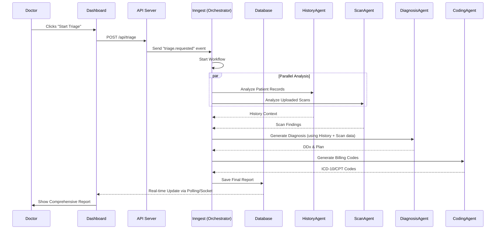
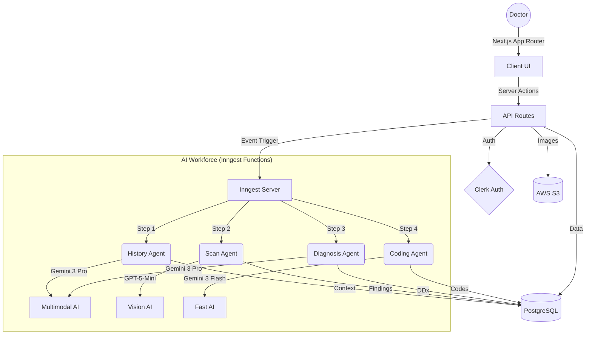

# Med-Gemini: Multi-Agent Clinical Operating System



> **Designed as a force multiplier for healthcare systems in developing nations, where patient loads are overwhelming and medical professionals are scarce. Our multi-agent AI system triages, analyzes, and documents cases, enabling doctors to focus their time where it matters most: saving lives.**

## 🌍 The Problem
In many developing nations, the doctor-to-patient ratio is critically low (often 1:10,000+). Physicians see 100+ patients daily, leading to:
- **Burnout**: Doctors are overworked and exhausted.
- **Missed Diagnoses**: Rapid consultations can lead to errors.
- **Documentation Burden**: valuable time is lost to paperwork.
- **Delayed Treatment**: Critical cases may wait too long in maximizing queues.

## 💡 The Solution: Med-Gemini
Med-Gemini is an intelligent Clinical Operating System powered by a **Multi-Agent AI Workforce**. It acts as a super-powered medical resident that never sleeps, handling:
1.  **Intelligent Triage**: Analyzing symptoms and vitals to prioritize critical patients.
2.  **Scan Analysis**: Instantly reading X-Rays, CTs, and MRIs to flag abnormalities.
3.  **Clinical Documentation**: Auto-generating SOAP notes, coding (ICD-10/CPT), and discharge summaries.
4.  **History Analysis**: Summarizing years of patient records in seconds.

## 🤖 The AI Workforce (Powered by Gemini 3)

Our system uses a coordinated fleet of specialized AI agents:



### Agent Roles & Responsibilities



| Agent | Model | Role | Key Output |
|-------|-------|------|------------|
| **Orchestrator** | Gemini 3 Pro | "Chief Resident" - Coordinates all agents, synthesizes data, and builds the final report. | Comprehensive Medical Report |
| **History Agent** | Gemini 3 Pro | Context Analyzer - Reviews EHR, medications, allergies, and past encounters. | Patient Context Summary |
| **Scan Agent** | GPT-5 Mini | Radiologist - Analyzes DICOM/Image files for abnormalities (fractures, masses, etc.). | Findings & Severity |
| **Diagnosis Agent** | Gemini 3 Pro | Clinician - Generates differential diagnoses, risk assessments, and care plans. | DDx & Urgency Level |
| **Coding Agent** | Gemini 3 Flash | Administrator - Handles medical coding (ICD-10, CPT) for billing and records. | Billing Codes |

## ⚙️ System Workflow
The following diagram illustrates how data flows through the system when a triage event is triggered:



## 🏗 High-Level Architecture



## 🛠 Tech Stack

- **Frontend**: [Next.js 16](https://nextjs.org/) (App Router), [Tailwind CSS](https://tailwindcss.com/), [Framer Motion](https://www.framer.com/motion/), [Shadcn UI](https://ui.shadcn.com/)
- **Backend**: Next.js Server Actions, [Prisma ORM](https://www.prisma.io/)
- **AI Core**: Google Gemini 3 (Pro/Flash), OpenAI GPT-5 Mini (Vision)
- **Orchestration**: [Inngest](https://inngest.com/) (Event-driven AI workflows)
- **Database**: [PostgreSQL](https://www.postgresql.org/)
- **Authentication**: [Clerk](https://clerk.com/)
- **Storage**: AWS S3 (Secure Medical Imaging Storage)

## 📂 Project Structure

```bash
med-agent/
├── src/
│   ├── app/                # Next.js App Router (Pages & API Routes)
│   ├── components/         # React Components (UI, Dashboard, Landing)
│   ├── lib/
│   │   ├── ai/             # AI Logic & Agent Definitions
│   │   │   └── agents/     # Individual Agent Implementations
│   │   ├── prisma.ts       # Database Client
│   │   └── utils.ts        # Helper Functions
│   └── inngest/            # Inngest Workflow Definitions
├── prisma/                 # Database Schema
├── public/                 # Static Assets
└── docs/                   # Documentation
```

## 🚀 Getting Started

### Prerequisites
- Node.js 18+
- PostgreSQL Database URL
- API Keys: Google Gemini, OpenAI, Clerk, AWS S3

### Installation

1.  **Clone the repository**
    ```bash
    git clone https://github.com/mry0tt4/med-gemini.git
    cd med-gemini
    ```

2.  **Install dependencies**
    ```bash
    npm install
    ```

3.  **Set up Environment Variables**
    Copy `.env.example` to `.env` and fill in your keys.
    ```bash
    cp .env.example .env
    ```

4.  **Database Migration**
    ```bash
    npx prisma migrate dev
    ```

5.  **Run Development Server**
    ```bash
    npm run dev
    ```

6.  **Start Inngest (AI Orchestration)**
    In a separate terminal:
    ```bash
    npx inngest-cli@latest dev
    ```

7.  **Open the App**
    Visit `http://localhost:3000`

## 📚 Documentation

Detailed documentation is available in the `docs/` directory:

- [**AI Agents Architecture**](docs/AI_AGENTS.md): Deep dive into the orchestrator and specialized agents.
- [**System Architecture**](docs/SYSTEM_ARCHITECTURE.md): Technical overview of the full stack.
- [**API Reference**](docs/API_REFERENCE.md): Endpoints for patients, reports, and triage.
- [**Deployment Guide**](docs/DEPLOYMENT.md): Hosting on Vercel, Docker, and environment setup.
- [**Process Diagrams**](diagrams/): Visual workflows and agent interactions.

## 🏆 Hackathon Details
This project demonstrates how **Gemini 3's** long-context window and advanced reasoning capabilities can be applied to complex, multi-modal medical data to solve real-world problems.

---

**Built with ❤️ for healthcare workers everywhere.**
