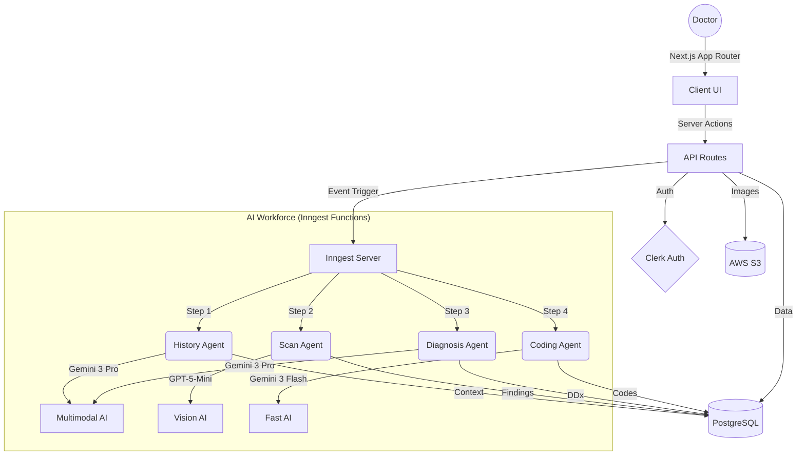

# System Architecture

## Overview
Med-Gemini is a sophisticated, event-driven medical application built on Next.js 16. It combines a user-friendly frontend with a powerful backend orchestrated by AI agents.

## 🏗️ High-Level Architecture Diagram

## 🧩 Key Components

### 1. Frontend (Next.js 16)
- **App Router**: Uses nested layouts and parallel routes for dashboards.
- **Server Components**: Fetch data directly on the server for speed and SEO.
- **Client Components**: Handle user interactions (Forms, Modals, Drag-and-Drop).
- **Styling**: Tailwind CSS + Shadcn UI ensures a modern, accessible interface.

### 2. Backend & API
- **Server Actions**: Provide type-safe endpoints for mutations (e.g., `createPatient`, `uploadScan`).
- **Route Handlers**: Example: `/api/scans/presign` handles secure file uploads to S3.
- **Middleware**: Clerk handles authentication and route protection at the edge.

### 3. Database (PostgreSQL + Prisma)
- **Schema**: Defines clear relationships between Patients, Encounters, Scans, and Reports.
- **Migrations**: Managed via Prisma Migrate for consistent schema evolution.

### 4. AI Orchestration (Inngest)
- **Problem**: AI tasks (e.g., analyzing 50 pages of medical history) take time (10-30s+), often timing out standard API requests.
- **Solution**: Inngest provides durable execution.
    1.  User clicks "Start Triage".
    2.  An event `triage.requested` is sent to Inngest.
    3.  Inngest triggers the `generateTriageReport` function.
    4.  The function executes step-by-step, retrying on failure, ensuring reliability.

### 5. Storage (AWS S3)
- **Direct Uploads**: We use Presigned URLs so the client uploads directly to S3, bypassing our server bandwidth limits.
- **Private Access**: Files are private by default; we generate time-limited signed URLs for viewing.

## 🔄 Data Flow: The "Triage" Event

1.  **Trigger**: Doctor initiates triage for a patient encounter.
2.  **Event**: `triage.requested` payload contains `{ encounterId, patientId }`.
3.  **Step 1: History Analysis**:
    *   Fetches last 5 encounters and all medications.
    *   Summarizes key trends using Gemini 3 Pro.
4.  **Step 2: Scan Analysis**:
    *   Checks for new DICOM/Image files.
    *   Uses Vision AI to identify pathologies.
5.  **Step 3: Diagnosis**:
    *   Synthesizes History + Scan findings.
    *   Generates a structured assessment and plan.
6.  **Step 4: Coding**:
    *   Maps the diagnosis to ICD-10 codes for billing.
7.  **Completion**:
    *   Updates the `TriageReport` in the database.
    *   Notifies the frontend (via polling or websocket) to refresh.
